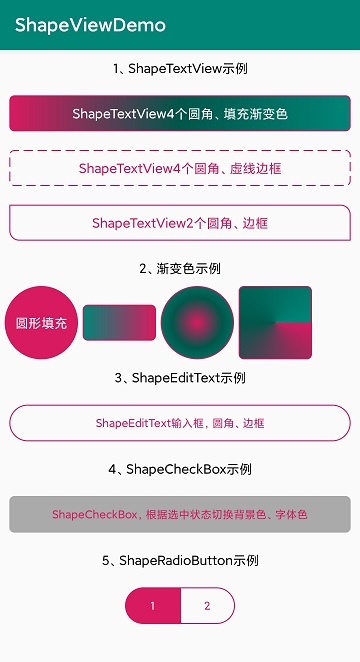

# ShapeView组件：

自定义带圆角背景的ShapeTextView、ShapeEditText、ShapeImageView、ShapeLinearLayout、ShapeRelativeLayout；

自定义根据状态切换背景色、字体色的ShapeCheckBox、ShapeRadioButton；

UI设计图会经常出现不同圆角、不同背景色的按钮和输入框。
甚至还有很多会根据状态来切换字体颜色和背景颜色的按钮。

最常见的做法就是定义好需要的Shape后，在XML中设置属性使用，但是如果有很多个不同样式的时候，我们就需要定义很多个Shape，写起来很是麻烦的。
    

#  ShapeView组件效果



#  如何使用ShapeView组件

# 1、在根目录 build.gradle 添加:

```
allprojects {
		repositories {
			...
			maven { url 'https://jitpack.io' }
		}
	}
```

# 2、在app项目下的build.gradle中添加：

```
dependencies {
	        implementation 'com.github.mtjsoft:ShapeView:v2.0.1'
	}
```

[](https://jitpack.io/#mtjsoft/ShapeView)


# 4、GridPager组件的版本及属性说明

V2.0.1
--------------------------
- 重构设置属性代码。统一由 setBuilder(CustomBuilder builder)方法设置，详见demo
- 新增渐变色相关属性
- 新增虚线属性

2.0.0 新增属性  | 属性说明 | 备注
------------- | ------------- | -------------
shape  | shape类型。integer 0~3 分别对应 GradientDrawable.RECTANGLE, GradientDrawable.OVAL, GradientDrawable.LINE, GradientDrawable.RING  | 2022-1-14
startColor  | 渐变开始颜色
centerColor  | 渐变中间颜色
endColor  | 渐变结束颜色
startSelectColor  | openSelector属性为true 时的选中渐变开始颜色
centerSelectColor  | openSelector属性为true 时的选中渐变中间颜色
endSelectColor  | openSelector属性为true 时的选中渐变结束颜色
orientation  | 渐变方向。integer 0~7 分别对应 GradientDrawable.Orientation枚举类中的值
gradientType  | 渐变类型。支持线性渐变、放射性渐变、扫描式渐变 integer 0~2 分别对应 GradientDrawable.LINEAR_GRADIENT, GradientDrawable.RADIAL_GRADIENT, GradientDrawable.SWEEP_GRADIENT
gradientRadius  | 渐变半径. 只有当渐变类型设置为 RADIAL_GRADIENT  时，半径才有效。format="float"
dashWidth  | 虚线边框宽度
dashGap  | 虚线边框间隙

V1.2.0
--------------------------
- 升AndroidX

V1.1.0
--------------------------

1.1.0说明 | 备注
------------- | ------------- 
新增了代码中动态设置的set方法 | 动态设置完属性后，setCustomBackground()展示

V1.0.0
--------------------------

1.0.0 属性  | 属性说明 | 备注
------------- | ------------- | -------------
solidColor  | 填充色 | 2019-10-10 12:22:12
strokeColor  | 边框色
strokeWidth  | 边框宽度
radius  | 圆角弧度（4个角的弧度）
topLeftRadius  | 单独设置左上角弧度
topRightRadius  | 单独设置右上角弧度
bottomLeftRadius  | 单独设置左下角弧度
bottomRightRadius  | 单独设置右下角弧度
openSelector  | 是否使用Selector选择器 | ShapeCheckBox、ShapeRadioButton有以下属性
textNormalColor  | 使用选择器时的默认字体色
textSelectColor  | 使用选择器时的选中字体色
solidSelectColor  | 使用选择器时的选中填充色
strokeSelectColor  | 使用选择器时的选中边框色

# 4、在需要使用的布局xml中添加ShapeView组件，根据需要设置相关属性

### ShapeTextView4个圆角、填充色
```
<cn.mtjsoft.www.shapeview.ShapeTextView
            android:layout_width="match_parent"
            android:layout_height="wrap_content"
            android:layout_margin="10dp"
            android:gravity="center"
            android:padding="10dp"
            android:text="ShapeTextView4个圆角、填充色"
            android:textColor="@android:color/white"
            android:textSize="14sp"
            app:radius="5dp"
            app:solidColor="@color/colorAccent" />
```
### ShapeTextView2个圆角、边框
```
<cn.mtjsoft.www.shapeview.ShapeTextView
            android:layout_width="match_parent"
            android:layout_height="wrap_content"
            android:layout_margin="10dp"
            android:gravity="center"
            android:padding="10dp"
            android:text="ShapeTextView2个圆角、边框"
            android:textColor="@color/colorAccent"
            android:textSize="14sp"
            app:bottomLeftRadius="10dp"
            app:strokeColor="@color/colorAccent"
            app:strokeWidth="1dp"
            app:topRightRadius="10dp" />
```
### ShapeEditText输入框，圆角、边框
```
<cn.mtjsoft.www.shapeview.ShapeEditText
            android:layout_width="match_parent"
            android:layout_height="40dp"
            android:layout_margin="10dp"
            android:gravity="center"
            android:text="ShapeEditText输入框，圆角、边框"
            android:textColor="@color/colorAccent"
            android:textSize="12sp"
            app:radius="20dp"
            app:strokeColor="@color/colorAccent"
            app:strokeWidth="1dp" />
```
### ShapeCheckBox，根据选中状态切换背景色、字体色
```
<cn.mtjsoft.www.shapeview.ShapeCheckBox
            android:layout_width="match_parent"
            android:layout_height="40dp"
            android:layout_margin="10dp"
            android:gravity="center"
            android:text="ShapeCheckBox，根据选中状态切换背景色、字体色"
            android:textSize="12sp"
            app:radius="5dp"
            app:strokeWidth="1dp"
            app:strokeColor="@color/colorAccent"
            app:openSelector="true"
            app:solidSelectColor="@android:color/darker_gray"
            app:strokeSelectColor="@android:color/darker_gray"
            app:textNormalColor="@color/colorPrimary"
            app:textSelectColor="@color/colorAccent"/>
```
### ShapeRadioButton示例
```
<RadioGroup
            android:layout_width="wrap_content"
            android:layout_height="wrap_content"
            android:layout_margin="10dp"
            android:orientation="horizontal">

            <cn.mtjsoft.www.shapeview.ShapeRadioButton
                android:layout_width="60dp"
                android:layout_height="40dp"
                android:gravity="center"
                android:textSize="12sp"
                android:text="1"
                app:topLeftRadius="20dp"
                app:bottomLeftRadius="20dp"
                app:strokeWidth="1dp"
                app:strokeColor="@color/colorAccent"
                app:openSelector="true"
                app:solidSelectColor="@color/colorAccent"
                app:strokeSelectColor="@color/colorAccent"
                app:textNormalColor="@color/colorAccent"
                app:textSelectColor="@android:color/white"/>

            <cn.mtjsoft.www.shapeview.ShapeRadioButton
                android:layout_width="60dp"
                android:layout_height="40dp"
                android:gravity="center"
                android:textSize="12sp"
                android:text="2"
                app:topRightRadius="20dp"
                app:bottomRightRadius="20dp"
                app:strokeWidth="1dp"
                app:strokeColor="@color/colorAccent"
                app:openSelector="true"
                app:solidSelectColor="@color/colorAccent"
                app:strokeSelectColor="@color/colorAccent"
                app:textNormalColor="@color/colorAccent"
                app:textSelectColor="@android:color/white"/>
        </RadioGroup>
```
### 渐变颜色示例

```
<LinearLayout
            android:layout_width="match_parent"
            android:layout_height="wrap_content"
            android:gravity="center_vertical"
            android:orientation="horizontal">

            <cn.mtjsoft.www.shapeview.ShapeTextView
                android:layout_width="80dp"
                android:layout_height="wrap_content"
                android:layout_margin="10dp"
                android:gravity="center"
                android:padding="10dp"
                android:text=""
                android:textColor="@android:color/white"
                android:textSize="14sp"
                app:strokeColor="@color/colorAccent"
                app:strokeWidth="1dp"
                app:orientation="2"
                app:startColor="@color/colorAccent"
                app:endColor="@color/colorPrimary"
                app:radius="5dp" />

            <cn.mtjsoft.www.shapeview.ShapeTextView
                android:layout_width="80dp"
                android:layout_height="80dp"
                android:layout_marginEnd="10dp"
                android:gravity="center"
                android:text=""
                android:textColor="@android:color/white"
                android:textSize="14sp"
                app:strokeColor="@color/colorAccent"
                app:strokeWidth="1dp"
                app:shape="1"
                app:gradientType="1"
                app:gradientRadius="150f"
                app:startColor="@color/colorAccent"
                app:centerColor="@color/colorPrimaryDark"
                app:endColor="@color/colorPrimary"
                app:radius="5dp" />

            <cn.mtjsoft.www.shapeview.ShapeTextView
                android:layout_width="80dp"
                android:layout_height="80dp"
                android:layout_marginEnd="10dp"
                android:gravity="center"
                android:text=""
                android:textColor="@android:color/white"
                android:textSize="14sp"
                app:strokeColor="@color/colorAccent"
                app:strokeWidth="1dp"
                app:shape="0"
                app:gradientType="2"
                app:gradientRadius="150f"
                app:startColor="@color/colorAccent"
                app:centerColor="@color/colorPrimaryDark"
                app:endColor="@color/colorPrimary"
                app:radius="5dp" />
        </LinearLayout>
```

**添加我个人微信号交流，记得添加时备注一下哦**


**本人公众号，也可关注一波，共同交流吧。**


